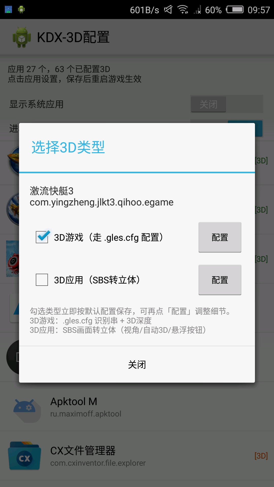
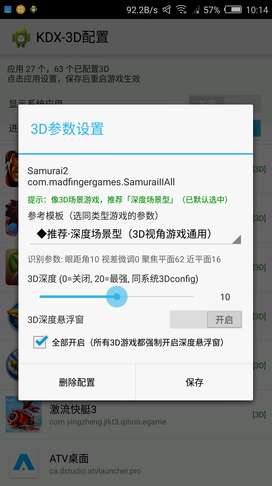
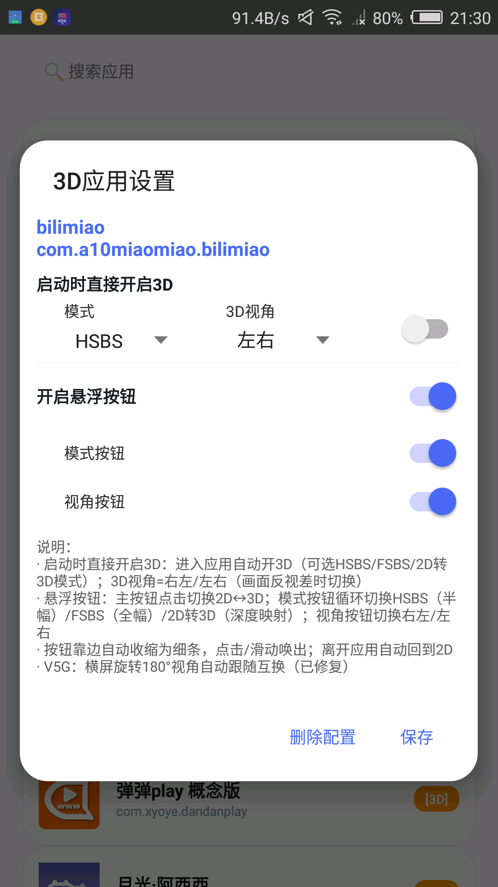
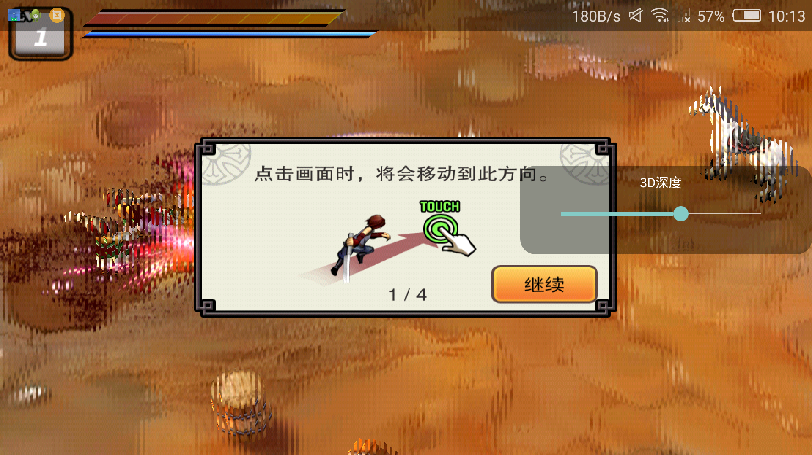
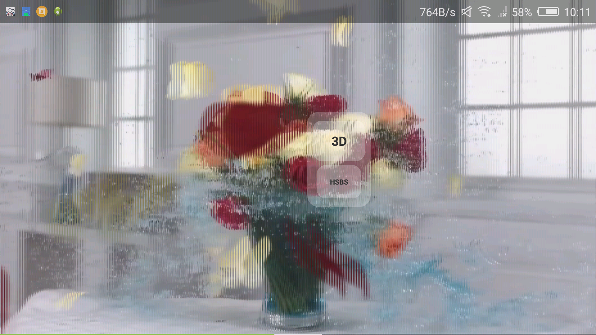
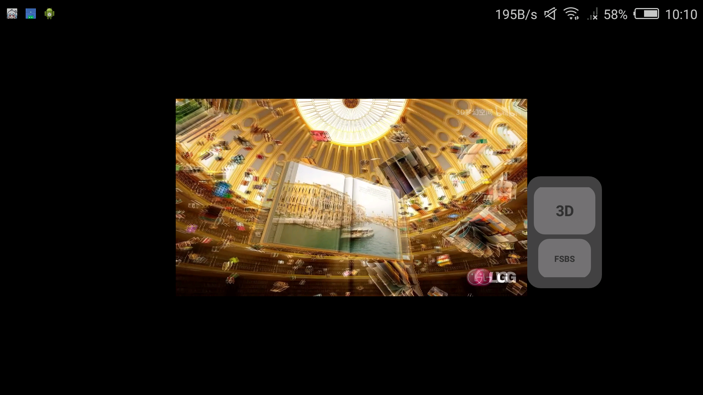
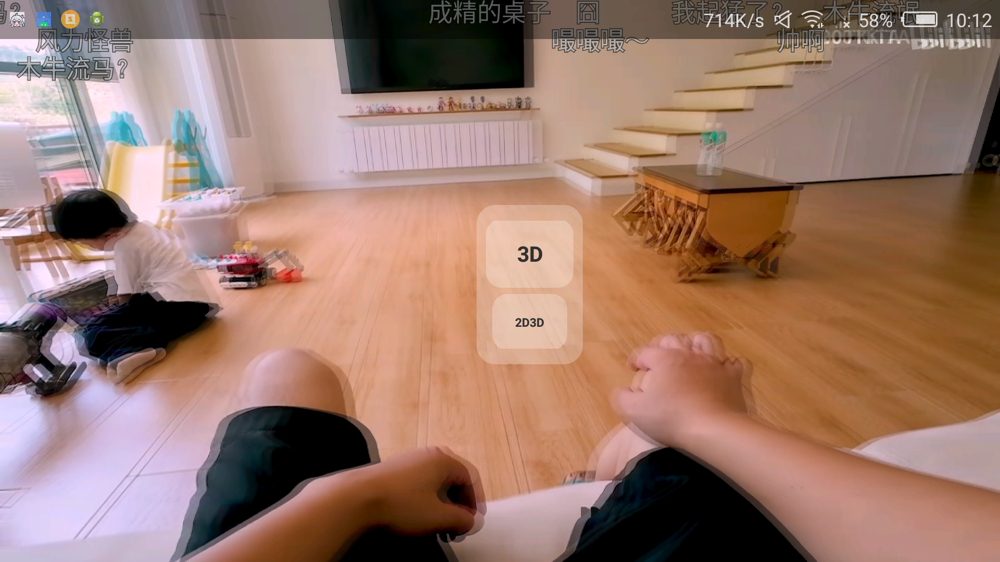

# K3DX-3DConfig（KDX-3D配置）

> **裸眼 3D 手机统一 3D 配置工具**（适用于康得新 KDX 技术裸眼 3D 设备）

**语言：中文**（[English](./README_EN.md)）

---

## 📌 项目简介

康得新（KDX）技术的裸眼 3D 手机，其 3D 功能分散在多个系统组件中、体验不统一：

- **3D 游戏**：依赖系统 libGLES 注入层读取 `.gles.cfg` 配置
- **3D 应用**：依赖系统 3DService 的 SBS 画面转立体功能（悬浮按钮），功能不完整且有白名单限制

**本项目诞生的原因**：理论上可以用于**所有康得新技术的裸眼 3D 设备**，想要**统一康得新 3D 手机的 3D 功能体验**——一个 App 完成游戏 3D 配置、应用 SBS 转立体的全部控制。

> ⚠️ **AI 构建声明**：本项目为**纯 AI 构建项目**，由 **DeepSeek V4 Flash + Hermes Agent** 全程开发完成（包括源码、逆向分析、调试迭代）。

---

## 📱 设备适用情况

| 设备 | 3D游戏配置 | 游戏深度调节 | 3D应用（SBS转立体） | 说明 |
|------|:---:|:---:|:---:|------|
| **K3DX-V5G**（中兴/努比亚） | ✅ | ✅ | ✅ | **功能全部正常**（开发测试机） |
| **中兴 C2017** | ✅ | ❌ | ✅ | 游戏不能深度调节，其他正常 |
| **koobee F2** | ✅ | ✅ | ❌ | 游戏深度调节可用，3D应用测试不可用 |
| **长虹 X1** | ❌ | ❌ | ❌ | 不可用 |
| **午诺 P8**（Unno P8） | ❓ | ❓ | ❓ | 未测试 |
| **D Color 7.0** | ❓ | ❓ | ❓ | 未测试 |
| **Blackview P2 Lite 3D** | ❓ | ❓ | ❓ | 未测试 |
| **Elephone P8 3D** | ❓ | ❓ | ❓ | 未测试 |
| **康佳幻影T1 裸眼3D版**（Konka Phantom T1） | ❓ | ❓ | ❓ | 未测试 |
| **天津蓝酷 LK7**（BlueCool LK7） | ❓ | ❓ | ❓ | 未测试 |

---

## ✨ 功能特性

### 🎮 3D 游戏
- `.gles.cfg` 配置管理：内置 **119 条官方完整配置串**（深度场景型 / 平面分层型分组），一键写入、快速匹配
- 配置文件不存在时自动创建
- **每游戏 3D 深度悬浮窗**（半透明滑条，实时调节）+ 全局「全部开启」选项
- 3D 深度记忆（按应用）+ 模板选择记忆（持久化）

### 📺 3D 应用（SBS 转立体）
- **3 种显示模式**：HSBS（半幅 SBS）/ FSBS（全幅 SBS）/ 2D转3D
- **3D 视角切换**：视角1（右左）/ 视角2（左右）
- 启动时自动开启 3D 模式（可选模式）
- 悬浮按钮：上下双按钮（主按钮 2D↔3D 切换 + 模式按钮循环），点击立即响应；靠边自动收缩为边缘细条、点击/滑动唤出

### 🔒 进程守护（可选，root）
- Magisk 模块：开机自启 + 被杀自动拉起 + OOM 防杀
- 系统进程白名单写入（后台驻留）

---

## 🔐 权限说明

**存储访问**

| 权限 | 用途 | 条件 |
|------|------|------|
| `WRITE/READ_EXTERNAL_STORAGE` | 读写 `/storage/emulated/0/.gles.cfg` | Android 6.0+ 运行时申请 |
| `MANAGE_EXTERNAL_STORAGE` | 分区存储下访问存储根目录 | Android 11+ 设置页授权 |

**界面与通知**

| 权限 | 用途 | 条件 |
|------|------|------|
| `SYSTEM_ALERT_WINDOW` | 悬浮窗 | Android 6.0+ 设置页授权 |
| `POST_NOTIFICATIONS` | 通知栏快捷开关 | Android 13+ 运行时申请 |

**后台运行**

| 权限 | 用途 | 条件 |
|------|------|------|
| `FOREGROUND_SERVICE` | 前台服务（悬浮窗常驻） | Android 9+ |
| `REQUEST_IGNORE_BATTERY_OPTIMIZATIONS` | 后台驻留防杀 | Android 6.0+ |
| `RECEIVE_BOOT_COMPLETED` | 开机自启 | 普通权限 |

**应用检测**

| 权限 | 用途 | 条件 |
|------|------|------|
| `PACKAGE_USAGE_STATS` | 前台应用检测（悬浮窗按应用显示） | 所有版本，设置页授权（AppOps） |

## 🧠 实现方法（简述）

### 1. 3D 游戏 —— `.gles.cfg` 机制
康得新 libGLES 注入层（`libGLES_kdx.so`）在游戏进程启动时读取 `/storage/emulated/0/.gles.cfg`，格式：

```
包名  32字节配置串（Base64）
```

- 32 字节结构：`[0:3]='KDX'` `[3]=0x1c` `[4:8]=校验值` `[8]=enableMix` `[9]=0xff` `[10]=eye` `[11]=parallax_adj` `[12]=focus_plane` `[13]=near_plane` `[14]=0x64` `[15:31]=0`
- **`[4:8]` 是参数区的自定义校验值**（经逆向验证：15 组同参数配置 ID 完全相同，常见哈希全部不匹配，算法在厂商生成器手中）——因此无法自行生成参数，只能复用官方完整串
- 本项目内置 **119 条官方配置串**（覆盖全部官方参数组合），换包名写入即可生效
- 深度调节：`setprop persist.sys.3deffect (0-20)`

### 2. 3D 应用 —— SBS 转立体接口
系统 3DService（`com.wztech.service3d`）通过 **binder 调用定制 SurfaceFlinger 的扩展服务**（`MyService.send()`）。逆向发现其 JNI 库 `libnative_wz2sf.so` 导出了 `Java_com_wztech_service3d_Service3D_send2sf`——本项目用**同名类 + System.load 零编译绑定**直接调用：

```
send2sf(8001, (msg << 16) | value)
```

| msg | 含义 | value |
|-----|------|-------|
| 100 | 3D 总开关 | 1=开 0=关 |
| 101 | 左右交换 / 视点 | VP01=1 VP02=0 |
| 103 | 显示模式 | **0=HSBS 1=FSBS 2=2D转3D** |

### 3. 前台应用检测
Android 5.1 上 `getRunningTasks`/`getRunningAppProcesses` 对第三方应用受限（只返回自己的任务/进程），使用 **UsageStatsManager**（`queryEvents` 取最近 `MOVE_TO_FOREGROUND`）识别前台应用。

### 4. 进程守护（可选 root）
- **Magisk 模块**（`assets/kdx3d_guard.zip`）：`service.sh` 开机执行常驻循环——检查开关状态 → 被杀自动 `am startservice` 拉起 + `oom_score_adj=-17` 防杀
- **进程白名单**：root 直接写 `cn.nubia.processmanager` 的 `process_white.db`

---

## 🔧 构建方法

纯命令行构建（无 Gradle），链：`aapt2 → javac → d8 → zipalign → apksigner`

```bash
python build.py
```

**依赖**：Android SDK（build-tools 35.0.0 + platform android-31）、JDK、Python 3

**Android 支持范围**：minSdk 19（Android 4.4）～ 最新

---

---

## 📷 界面预览

<table align="center"><tr>
<td align="center"><br/><sub>1. 两种配置方式</sub></td>
<td align="center"><br/><sub>2. 3D游戏配置</sub></td>
<td align="center"><br/><sub>3. 3D应用配置</sub></td>
<td align="center"><br/><sub>4. 游戏立体深度调节</sub></td>
<td align="center"><br/><sub>5. HSBS（半幅SBS）</sub></td>
<td align="center"><br/><sub>6. FSBS（全幅SBS，不能全屏）</sub></td>
<td align="center"><br/><sub>7. 2D转3D（简单算法分层）</sub></td>
</tr></table>

- **1**：点击应用勾选类型——3D游戏（.gles.cfg）或 3D应用（SBS转立体），勾选即存默认配置
- **2**：官方模板分组 + 深度调节（0-20）+ 深度悬浮窗开关与「全部开启」
- **3**：视角切换（1右左/2左右）+ 启动自动3D（HSBS/FSBS/2D转3D）+ 悬浮按钮
- **4**：游戏内半透明滑条实时调深度，靠边收缩、滑动唤出
- **5**：HSBS 半幅 SBS——左右各占半屏合成立体
- **6**：FSBS 全幅 SBS 无压缩；不能全屏（系统限制）
- **7**：2D转3D——简单算法分层（非AI转换）

---

## 📝 更新日志

- **1.2**：新增应用列表排序（3D游戏/应用优先）与搜索；3D应用悬浮窗模式/视角按钮独立开关；模板选择器搜索与推荐置顶；配置持久化到应用文件夹（覆盖更新不丢配置）；修复V5G横屏旋转视角不跟随的bug（180度旋转自动切换视角）；优化UI与性能
- **1.1**：新增3D应用悬浮窗视角切换按钮（右左/左右）；修复进程守护不生效、不能保存配置文件的bug；改了一些UI
- **1.0**：首个开源版本：3D 游戏/3D 应用完整配置功能+悬浮窗

---

## 💬 技术交流

QQ 技术交流群：**869206374**

---

## ⚠️ 免责声明

- 本项目**仅供技术学习与个人使用**，涉及系统接口调用（binder、属性、JNI 加载系统库）
- 使用 root 功能请自行评估风险
- 与康得新/中兴/努比亚等厂商无任何关联

## 📄 License

[MIT](./LICENSE)
